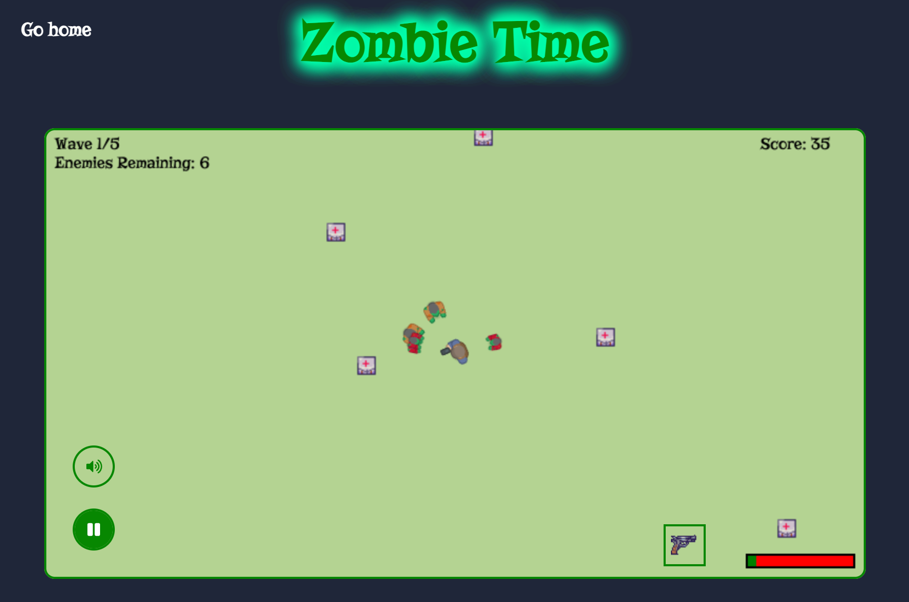

 

# Zombie Time

Welcome to Zombie Time! This is a web browser-based game developed for a week long [Mintbean](https://tinyurl.com/yhbpr783) hackathon.



Zombie Time was developed without any major frameworks, just vanilla JavaScript. The goal of the project was to see what kind of game we could build in a week without any kind of game engine to rely on.

   

---

## Installation

Git clone and cd into the repo folder:

```
git clone git@github.com:jfilm/zombie-time.git && cd zombie-time
```

Install the dependencies:

```
npm install
```

Run the command:

```
npm run start
```

---

## Live Site

[](https://jfilm.github.io/zombie-time/)

---

## Contributors

### Hunter Marshall

[](https://www.linkedin.com/in/dh-marshall/) [](https://github.com/beidah)

### Bohdan Kornatskyi

[](https://www.linkedin.com/in/bohdan-kornatskyi/) [](https://github.com/kornatskyi)

### John Asher

[](https://www.linkedin.com/in/-john-asher/) [](https://github.com/jfilm)

---

## Resources

- [Google Fonts](https://fonts.google.com/)

- [Kenny.nl](https://www.kenney.nl/assets/topdown-shooter)

- [OceansDream on OpenGameArt](https://opengameart.org/content/various-inventory-24-pixel-icon-set)
